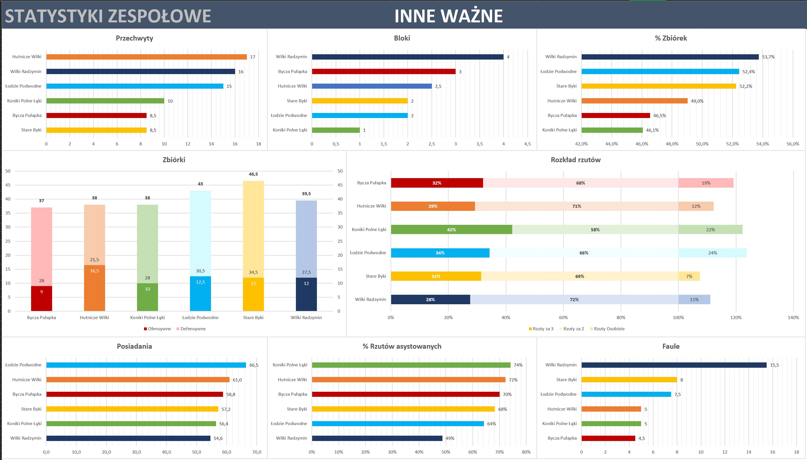
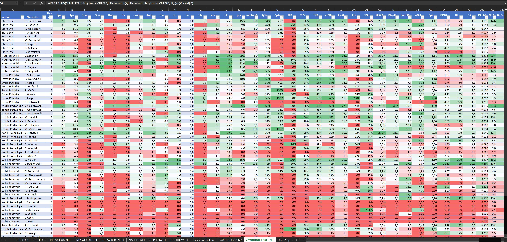

# **Basketball_League_Analytics –> Excel Dashboard**
Kompleksowa analiza danych ligowych wykonana w Excelu z wykorzystaniem Power Query, tabel przestawnych oraz interaktywnych dashboardów.

## **Opis projektu**
Celem projektu było przygotowanie zestawu analiz statystycznych dla amatorskiej ligi koszykarskiej, obejmujących wyniki meczów, statystyki graczy i zestawienia drużynowe. Dashboard ma formę interaktywną, jest w pełni automatyczny i oparty o jedno źródło danych ->
tabelę z danymi zawodników. Plik potrzebuje jedynie wklejenia statystyk z danego meczu, a cała reszta na wszystkich pozostałych akurszach automatycznie się uzupełnia. Są to prawdopodobnie najbardziej zaawansowane statystyki dla jakiejkolwiek koszykarskiej ligi amatorskiej w Polsce,
a ja jako fan liczb, statystyk oraz koszykówki postanowiłem wspomóc organizatorów swoimi umiejętnościami łącząc przyjemne z pożytecznym. Docelowo chcę przełożyć ten plik również do PowerBI, aby stworzyć jeszcze bardziej atrakcyjne wizualnie dashboardy.
Rozgrywki ligowe trwają w terminie 11-12.2025r i plik będzie ponownie uploadowany po każdej kolejce.

Projekt miał na celu:
- uporządkowanie i automatyzację danych ligowych
- stworzenie przejrzystych dashboardów dla organizatora / widzów
- prezentację umiejętności analitycznych w Excelu

## **Użyte narzędzia**
- Microsoft Excel
- Power Query – czyszczenie i transformacja danych
- Tabele przestawne
- Wykresy dynamiczne
- Formatowanie warunkowe
- Funkcje zagnieżdżone oraz wielokrotnie zagnieżdżone

## **Zawartość repozytorium**
- [Plik Excel](https://github.com/karolwalaszczyk1989/basketball_league_analytics/blob/main/statystyki%20liga%205x5%202%20kolejka%20github.xlsx)
- [Screenshoty](https://github.com/karolwalaszczyk1989/basketball_league_analytics/tree/main/screenshots)

## **Najważniejsze elementy analityczne**
- Pobieranie danych z plików zewnętrznych (Power Query)
- Pełna automatyzacja całego pliku dzięki użyciu szerokiego zakresu formuł
- Interaktywne dashboardy z fragmentatorami dla każdego zespołu

## **Podgląd dashboardów**
Statystyki zespołowe:

Statytstyki indywidualne:

Podsumowanie meczów w kolejce:

Tabela ze średnimi zawodników:

## **Autor**
**Karol Walaszczyk**

karolwalaszczyk1989@gmail.com

[LinkedIn](https://www.linkedin.com/in/karol-walaszczyk-781a91143/) not very used
